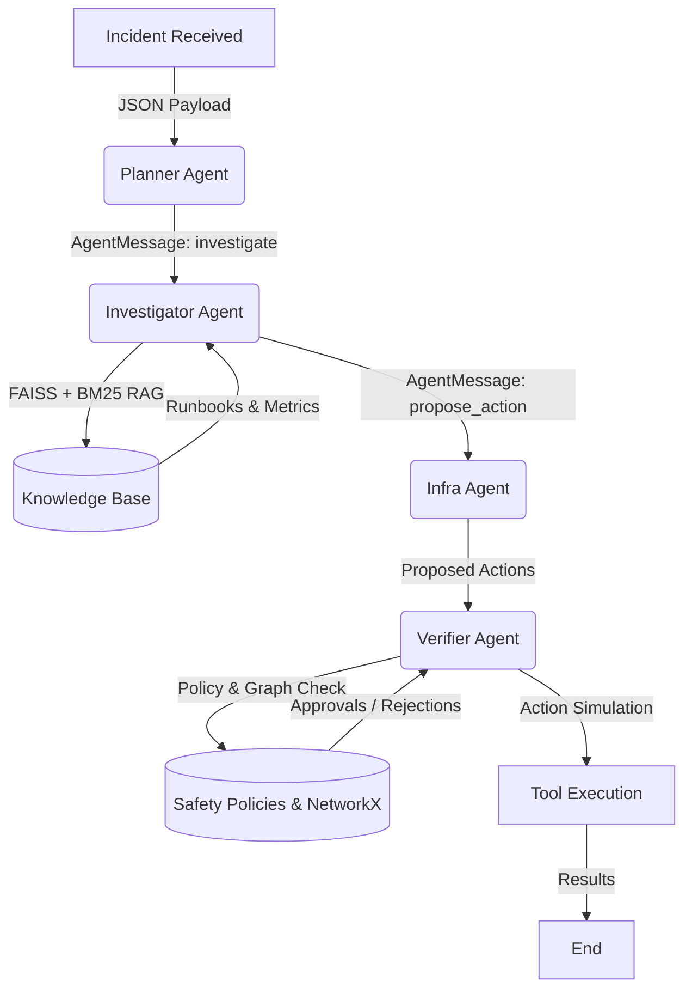

# Mini Agentic AI Platform

A LangGraph-based multi-agent prototype designed to securely analyze and remediate production incidents using explicit orchestration, semantic search (FAISS), and deterministic safety constraints.

## Architecture

1. Planner Agent: Analyzes incidents and constructs task payloads using structured `AgentMessage` schemas.
2. Investigator Agent (RAG): Retrieves logs, metrics, and runbooks using FAISS + BM25 to build context.
3. Infra Agent: Maps investigation context to explicit tool actions.
4. Verifier Agent: Intercepts actions, checks them against `policies/safety_rules.yaml` and the current `AUTONOMY_TIER`, and simulates blast radius checks against a NetworkX graph.

### Data & Control Flow

## Setup & Run

1. Install dependencies: `pip install -r requirements.txt`
2. Set API Key: Copy `.env.example` to `.env` and set `GOOGLE_API_KEY`.
3. Start API: `uvicorn src.api:app --reload`
4. Run CLI: `python src/main.py --incident-file data/incidents/payment_latency_incident.json`
5. Run Tests: `pytest tests/`

## Observability

All agent interactions are recorded via SQLite using `src/tracing.py`. You can retrieve full cost and latency traces using:
`curl http://localhost:8000/trace/<run_id>`
